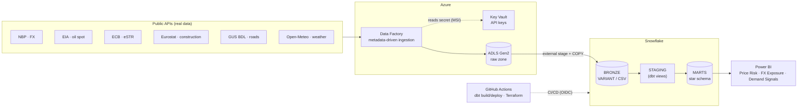

# Commodity & Macro Risk Intelligence Platform

End-to-end data platform that ingests **real, public, regularly-updated** data on
commodity prices, FX rates, interest rates, and construction/weather demand
signals — lands it in Azure, models it in Snowflake with dbt, and surfaces
**commodity price risk**, **FX exposure**, and **demand signals** in Power BI.

Built as a portfolio project to demonstrate **Snowflake (SnowPro Core)** and
**Azure Data Factory** skills, in a domain that mirrors real hedging and margin
reporting in petroleum-products trading.

> **No synthetic data.** Every source is a real public API serving real
> historical and current data.

## What this demonstrates

- **Azure Data Factory** — one *metadata-driven* pipeline (`Lookup → Filter → ForEach → Copy`) that ingests every source from a single JSON control file; adding a source is a config entry, not a new pipeline.
- **Snowflake** — external stage + `COPY INTO`, `VARIANT` + `LATERAL FLATTEN` for semi-structured JSON, a CSV source, Streams + Tasks (CDC), RBAC (loader vs read-only analyst), zero-copy clone for dev, resource monitor + auto-suspend cost guards, `ASOF JOIN` to reconcile mixed frequencies.
- **dbt Core** — medallion model (staging → intermediate → marts) with tests, docs, and a star schema; surrogate keys, a date spine, and referential-integrity tests.
- **Infrastructure as Code** — Terraform for all Azure resources (ADLS, ADF, Key Vault) with reusable modules and a per-environment split.
- **CI/CD** — GitHub Actions: PR builds dbt against a dev clone, merge deploys to prod; secretless auth via OIDC and managed identities.
- **Power BI** — a star-schema model and DAX from basics to advanced (`CALCULATE`, `ALL` / `ALLSELECTED`, `RANKX`, time intelligence).
- **Security** — API keys live only in Azure Key Vault (referenced by name); no secrets in the repo.

## Architecture

Full write-up: [docs/architecture.md](docs/architecture.md) ·
Cost & teardown: [docs/cost_model.md](docs/cost_model.md) ·
Project charter: [CLAUDE.md](CLAUDE.md).

## Data sources

| Source | Data | Auth | Frequency |
|--------|------|------|-----------|
| **NBP API** | USD/PLN, EUR/PLN mid rates | none | daily |
| **EIA API** | WTI (`RWTC`) & Brent (`RBRTE`) crude spot | api key | daily |
| **ECB SDW** | euro short-term rate (eSTR) | none | daily |
| **Eurostat** | civil-engineering production index (PL) | none | monthly |
| **GUS BDL** | expressway/motorway length (PL) | none* | annual |
| **Open-Meteo** | Warsaw daily weather (temp, precip) | none | daily |

\* GUS BDL works keyless at low rates; a free key raises limits.

> **Dropped by design:** *stooq.pl* now serves a JS anti-bot challenge instead of
> CSV, so WTI/Brent come from **EIA** spot instead. *World Bank Pink Sheet* ships
> as a multi-sheet `.xlsx`, which does not fit the metadata-driven Copy pattern,
> so it was skipped.

## Data model & reports

**Marts (Snowflake `MARTS`, star schema):** conformed `dim_date` / `dim_currency`
with fact tables for FX rates & cross rates, commodity prices, interest rates,
weather, and construction activity — plus `fct_daily_market_signals`, a wide mart
that reconciles daily / monthly / annual sources onto one daily grain via
`ASOF JOIN` (last-known-value).

**Power BI (read-only `ROLE_ANALYST`, Import mode):**

| Page | Shows |
|------|-------|
| **Price Risk** | WTI vs Brent spot, Brent–WTI spread |
| **FX Exposure** | USD/PLN & EUR/PLN, rebased index, 30-day volatility + ranking |
| **Demand Signals** | heating-degree-days (fuel demand), construction index, 20-year road growth |

## Tech stack

Azure Data Factory · ADLS Gen2 · Azure Key Vault · Snowflake · dbt Core ·
Terraform · GitHub Actions · Power BI.

## Repository layout

| Path | Purpose |
|------|---------|
| `infra/` | Terraform for Azure (ADLS, ADF, Key Vault) + subscription budget |
| `ingestion/` | Metadata-driven control file (`sources.json`) + exported ADF definitions |
| `snowflake/` | Non-dbt DDL: databases, RBAC, stages, bronze COPY, streams/tasks, clone, cost monitor |
| `dbt/` | dbt Core project (medallion: staging → intermediate → marts) |
| `powerbi/` | Power BI report notes + screenshots |
| `docs/` | Architecture, cost model, data dictionary |

## Engineering practices

- **Trunk-based** git with a protected `main` (PRs, linear history, squash/rebase).
- **CI/CD** (`.github/workflows/`): `sources.json` + Terraform validation on every
  PR; dbt `build` against a **dev zero-copy clone** on PR; deploy to **prod** on
  merge; control-file sync to ADLS via OIDC.
- **Secretless auth** throughout: ADF managed identity, Snowflake storage
  integration, GitHub OIDC federated credentials, Key Vault RBAC.

## Cost & teardown

Runs on free tiers / trial credit; measured usage is a few Snowflake credits and
cents of Azure per month. Every paid resource has a `terraform destroy` /
`DROP` path, and the whole platform is **reproducible from code** on a fresh
trial. Details: [docs/cost_model.md](docs/cost_model.md).

## Status

Core platform complete: ingestion, Snowflake modeling, dbt medallion, CI/CD, and
a three-page Power BI dashboard. Remaining work (final visual polish, ops notes)
is tracked as GitHub Issues on the project board.
