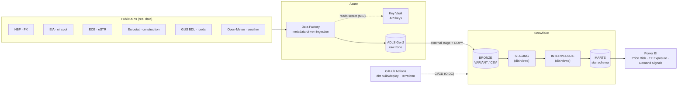

# Architecture

High-level charter lives in [CLAUDE.md](../CLAUDE.md) §3. This document is the
detailed write-up of how the pieces fit together.

## Data flow

## Layers

### 1. Ingestion — Azure Data Factory (metadata-driven)

A single generic pipeline `pl_ingest_source` reads
[ingestion/control/sources.json](../ingestion/control/sources.json) with a
Lookup, filters to enabled sources, then a ForEach calls a parameterized Copy
that lands each API response into ADLS under
`raw/source=<id>/dataset=<ds>/ingest_date=YYYY-MM-DD/`. Adding a source = one JSON
entry; the pipeline never changes. API keys are read at runtime from Key Vault via
the factory's managed identity (never stored in the repo or the ARM template).

### 2. Raw zone — ADLS Gen2

Immutable landing zone, partitioned by source + ingest date. Snowflake reads it
through an external stage backed by a storage integration (no account keys).

### 3. Bronze — Snowflake

`COPY INTO` loads each file as-is: JSON into a `VARIANT` column, the one CSV
source (ECB) into typed columns projected by position. A Streams + Tasks pipeline
demonstrates native incremental (CDC) loading on one source, alongside the dbt
path.

### 4. Transform — dbt Core (medallion)

- **staging** (`stg_*`, views) — parse `VARIANT`, type, rename, dedupe.
- **intermediate** (`int_*`, views) — reusable logic (FX returns, moving
  averages, rolling volatility).
- **marts** (`fct_*` / `dim_*`, tables) — star schema with conformed
  `dim_date` / `dim_currency`, plus `fct_daily_market_signals`, a wide reporting
  mart that reconciles mixed frequencies onto a daily grain.

### 5. Serve — Power BI

Connects with the read-only `ROLE_ANALYST` in Import mode. Three pages: price
risk, FX exposure, demand signals.

## Design decisions (resolved)

- **Mixed frequencies (daily / monthly / annual).** Reconciled in the
  `MARTS` layer with an `ASOF JOIN` onto a daily calendar spine — each day takes
  the last-known value of every source, giving exactly one row per day with no
  fan-out (guarded by a `unique` test on the grain).
- **Snowpipe vs scheduled COPY.** The load pattern is an external stage +
  scheduled `COPY`, run by a Snowflake Task (`snowflake/05`, daily). Snowpipe
  auto-ingest was considered but not built — a daily batch does not need
  event-driven ingest, and a scheduled Task keeps moving parts and cost down.
- **dev vs prod.** Separate Snowflake databases, with dev as a zero-copy clone of
  prod; dbt targets select between them, driven by CI.

## Environments & CI/CD

PR → validate `sources.json` + Terraform, and `dbt build` against the dev clone.
Merge to `main` → `dbt build` against prod and sync `sources.json` to ADLS. Azure
login uses GitHub OIDC (no stored credentials).

## Diagrams

Rendered inline above (Mermaid). Source-of-truth for the flow is this file and
the README.
